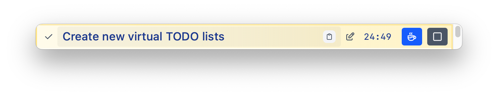
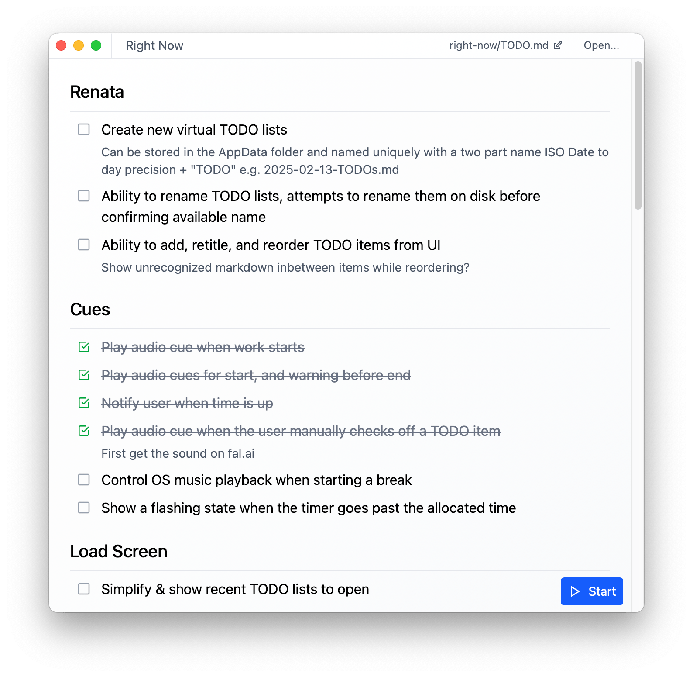

##  Right Now

- Offline desktop UI with Markdown-backed TODOs
- Pomodoro timer with customizable sound cues
- Terminal session tracking backed by a local daemon
- CLI workflows that keep your tasks and sessions in sync

## CLI Sessions (Resumption + Attention)

Right Now ships a `todo` CLI that talks to a background daemon (`right-now-daemon`). Sessions are real PTY shells tied to tasks in `TODO.md`, so you can detach and re-attach later.

How it works:
```
todo CLI → right-now-daemon → PTY shell
   ↘ updates TODO.md + emits notifications
```

Key capabilities:
- Start a session for a task and automatically attach.
- Detach with `Ctrl-\` and continue later with tail replay + live output.
- List sessions across projects and open deep links (`todos://session/<id>`).
- Attention detection: the daemon watches output for “needs input”/“build failed” style signals and sends terminal notifications with context.

Examples:
```bash
todo start "build pipeline"
todo start "run tests" --background
todo continue 42 --attach
todo list --project ~/projects/myapp/TODO.md
open todos://session/42
```

Shell prompt integration (optional):
```bash
todo shell-integration --install
```
This adds a prompt badge so your terminal shows the active session id and task.

Learn more:
- [PTY session resumption plan](./PLAN_PTY_SESSION_RESUMPTION.md)
- [Attention notifications](./docs/attention-notifications.md)

## Screenshots

### TODOs Tracker (floating window)


### TODOs Planner


## Recommended IDE Setup

- [VS Code](https://code.visualstudio.com/) + [Tauri](https://marketplace.visualstudio.com/items?itemName=tauri-apps.tauri-vscode) + [rust-analyzer](https://marketplace.visualstudio.com/items?itemName=rust-lang.rust-analyzer)
